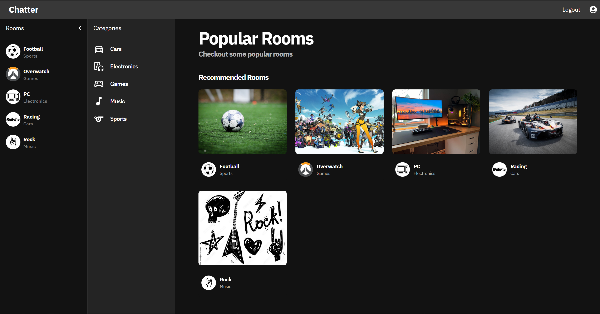
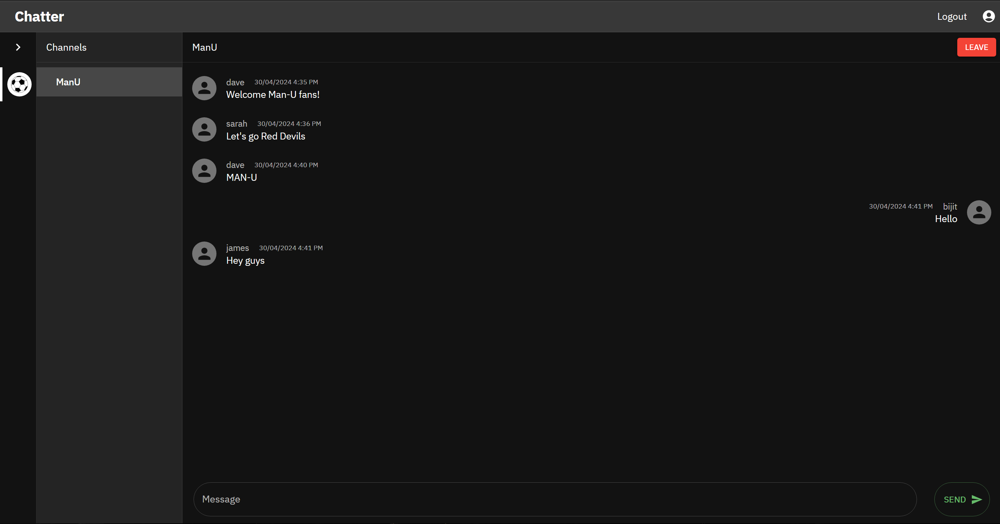
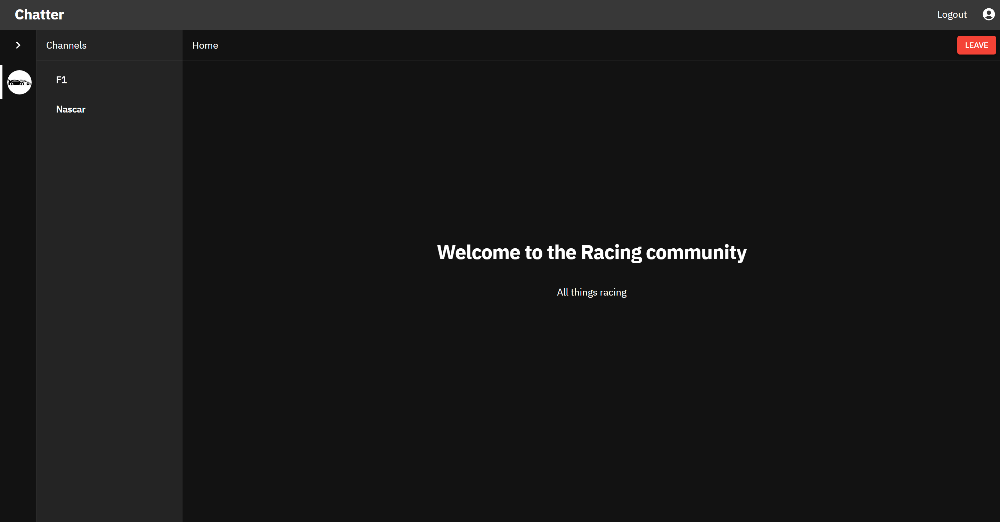
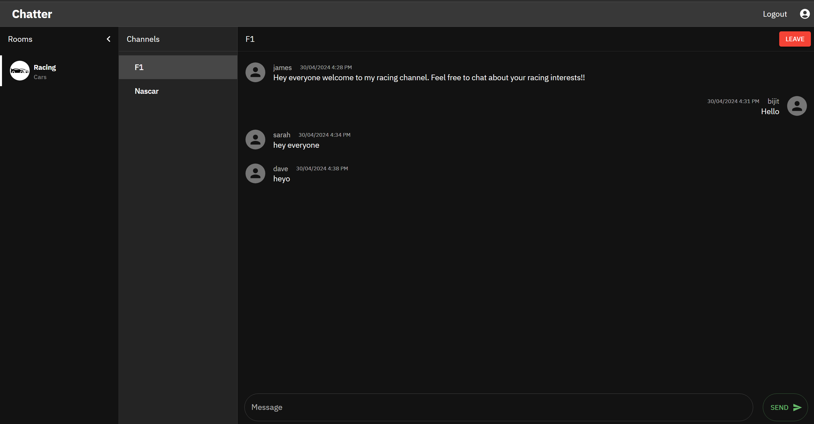
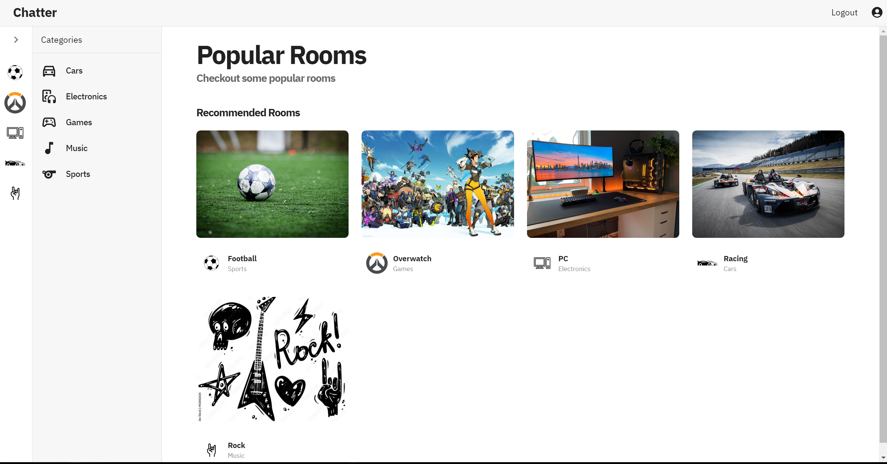
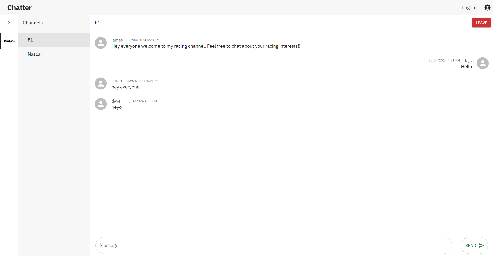
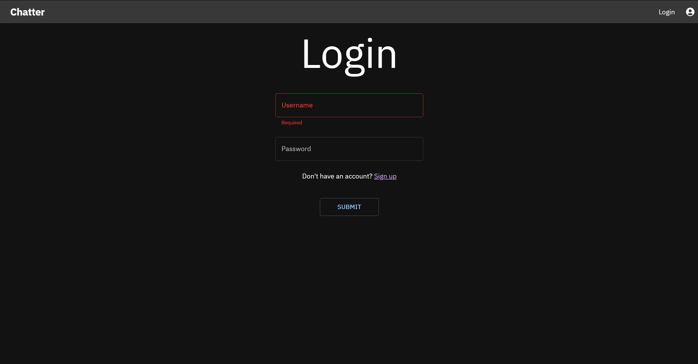
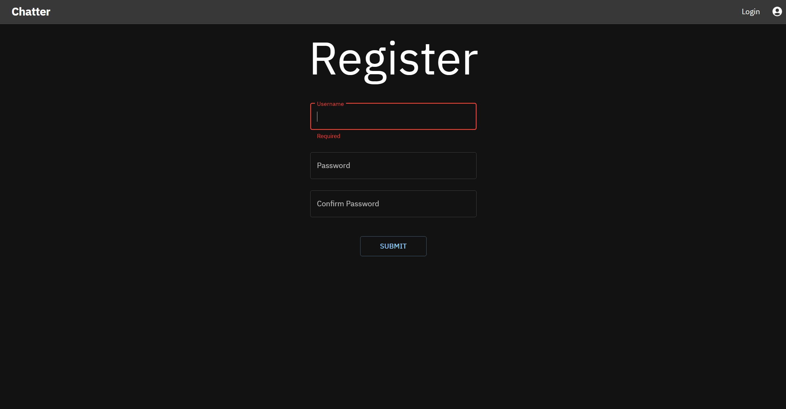
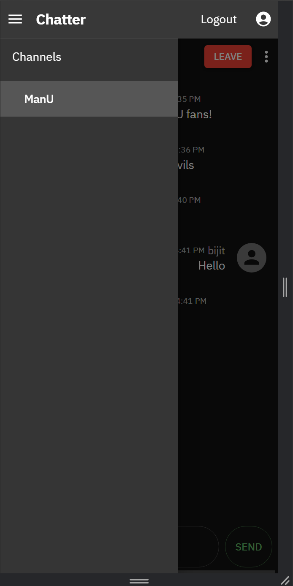
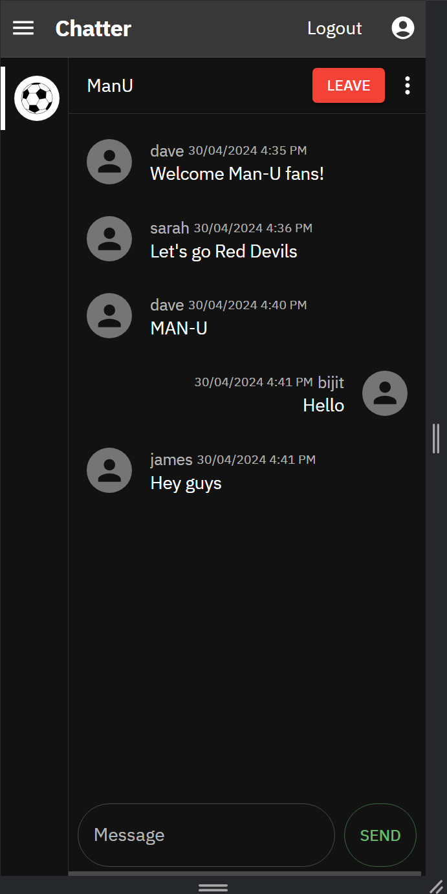

# Chatter

Chatter is a group chatting web application. Share you interests with people around the world and join servers to chat with people with similar interests.

## Installation

Clone the git repository to you machine. Must have [Node](https://nodejs.org/en) and [Python](https://www.python.org/) installed.

```bash
git clone {REPOSITORY_URL}
```
### Backend

- Create a virtual environment.
- Activate virtual environment after creating it. 
- cd into djangochat the backend server of this app. 
- Install requirements
- Run uvicorn server for backend

```bash
python -m venv <vevn>
<venv>\Scripts\Activate.ps1
cd djangochat
\djangochat> pip install requirements.txt
\djangochat> uvicorn djangochat.asgi:application --port 8000 --workers 4 --log-level debug --reload
```

### Frontend
Keep your backend uvicorn server running when running your frontend.
Use the package manager [npm](https://www.npmjs.com/) to install Chatter frontend.

- cd into frontend
- install npm
- build and run the app with npm

```bash
cd frontend
\frontend> npm install
\frontend> npm run build
\frontend> npm start
```

## Built With
- HTML
- CSS
- ReactJS (Frontend)
- MUI (React component library)
- Django (Python for backend)
- DRF (REST framework for Django)
- Django Channels(Websockets and ASGI requests)
- Uvicorn (Backend server for channel layers)


## Distinctiveness and Complexity
Chatter consists for 2 main parts. The frontend written using the React framework and the backend using Django. It is fully mobile responsive.<br>
The Django backend contains 3 apps :

1. Account - This app handles the authentication for accounts using simple-jwt, an authentication package that uses JWT(JavaScript Web Tokens). Authentication is customized by modifying simple-jwt and setting the JWTs as cookies instead of JSON response data, increasing security. It also provides minimal user details to the frontend.

2. Server - This app handles most of the API requests from the frontend using DRF(Django Rest Framework). It does most of the database lookups and even filters data based on query parameters in the request URL.

3. Webchat - This app handles all websocket requests and makes real time chatting possible using channels and channel layers. It also includes custom middleware for authentication of web sockets. The consumer file creates a long standing connection between the server and the client to enable instantaneous chatting. Most channel layer functions converted to synchronous functions for easier handling. It also provides message data to the frontend.

4. Static

The frontend is built using the build tool [Vite](https://vitejs.dev/) in ReactJS. Most components are imported from MUI(Material U.I.) a react component library.

1. Public - Contains screenshots for the project.

2. Src - Most of the frontend U.I. present here.
    - assets - Contains favicon.
    - components - Contains all the components for the page layouts.
    - context - Auth and Membership context for the frontend.
    - helpers - An axios interceptor that automatically refreshes an access token if it expires.
    - hooks - Contains a simple hook that performs basic CRUD operations.
    - pages - Contains page layouts and full pages.
    - schema - Uses yup to provide a schema for from validation.
    - services - Provides Auth, Membership and Route protection services.
    - theme - initializes MUI theme for the app.
    - Also contains the App.jsx file which provides context and routes to the entire app.

3. Contains various configuration files provided by Vite and also the index.html file which is the entry point into the frontend app.

## Usage

Login then select a server



Join server by clicking the join button on the top right. Select a channel and begin chatting!



## Links

Github - [https://github.com/bijitregmi/chatter](https://github.com/bijitregmi/chatter)

## Screenshots

Homepage


Server



Channel



Theme





Login



Register



Mobile





## Acknowledgement

- [React](https://react.dev/) - Documentation for most frontend implementations
- [MUI](https://mui.com/material-ui/getting-started/) - Material UI documentation for components
- [Stack overflow](https://stackoverflow.com/) - Answers for bugs and implementation ideas 
- [Django](https://www.djangoproject.com/) - Documentation for Django
- [DRF](https://www.django-rest-framework.org/) - Django rest framework documentation
- [Django Channels](https://channels.readthedocs.io/en/latest/) - Channels and channel layers documentation
- [Simple JWT](https://django-rest-framework-simplejwt.readthedocs.io/en/latest/) - Documentation for simple JWT
- [React router](https://reactrouter.com/en/main) - Help with routing frontend
- [React websockets](https://www.npmjs.com/package/react-use-websocket) - React websocket documentation

## License

[MIT](https://choosealicense.com/licenses/mit/)